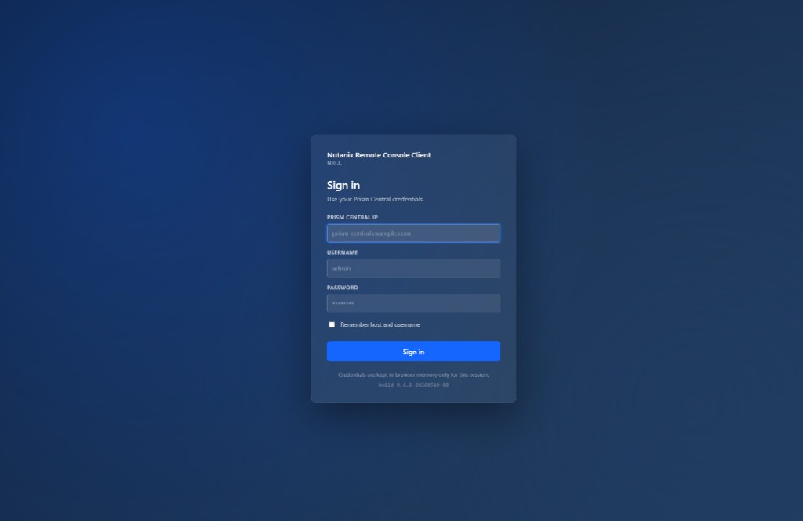
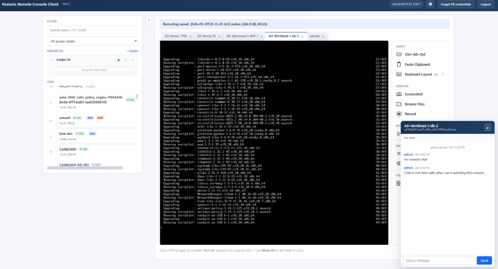
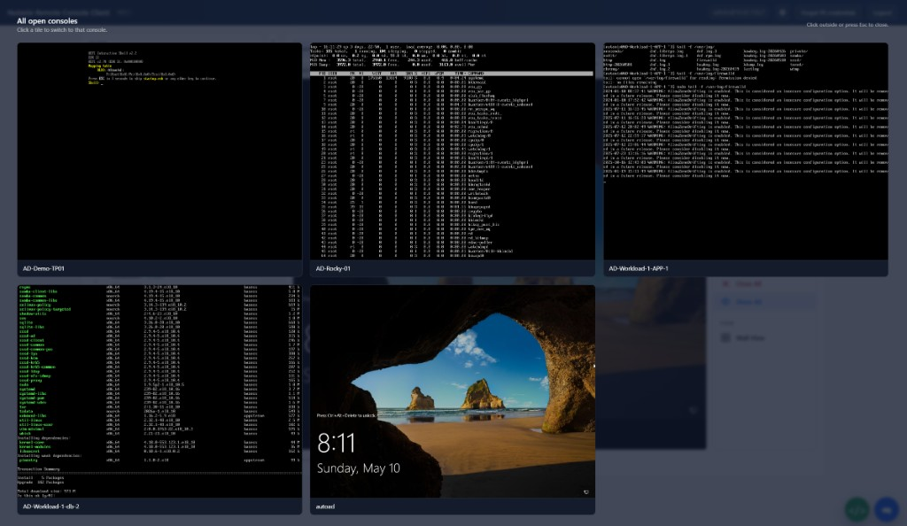
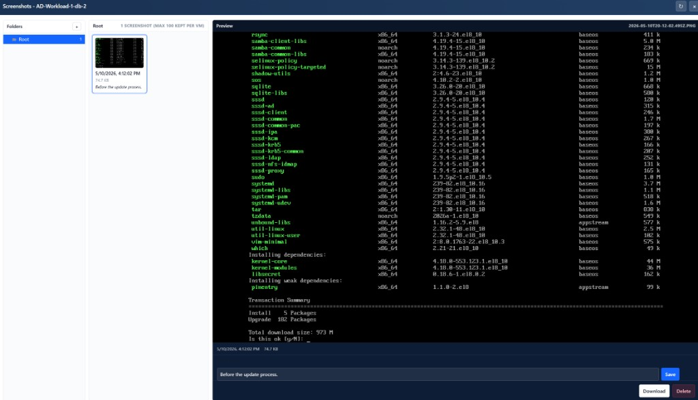
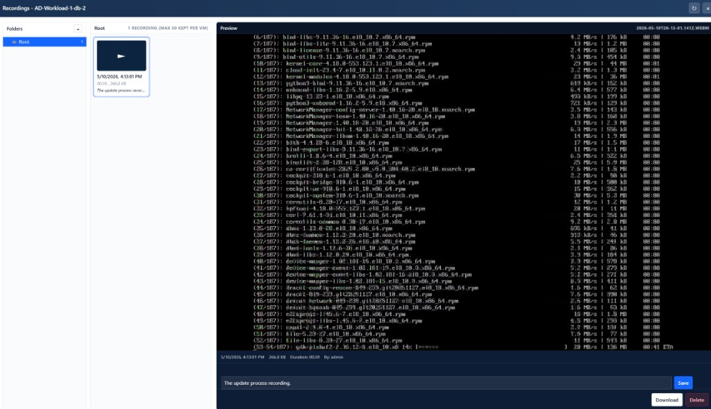
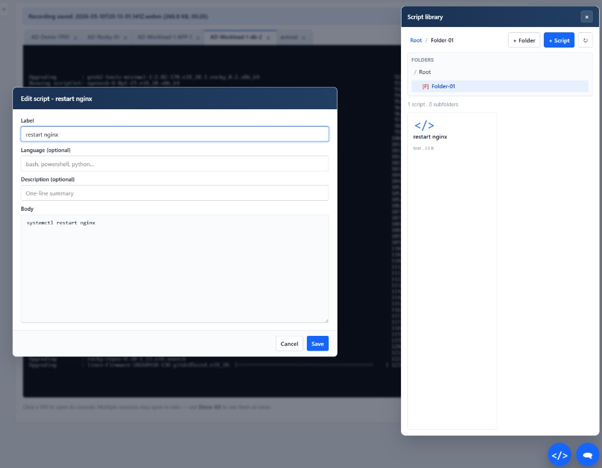
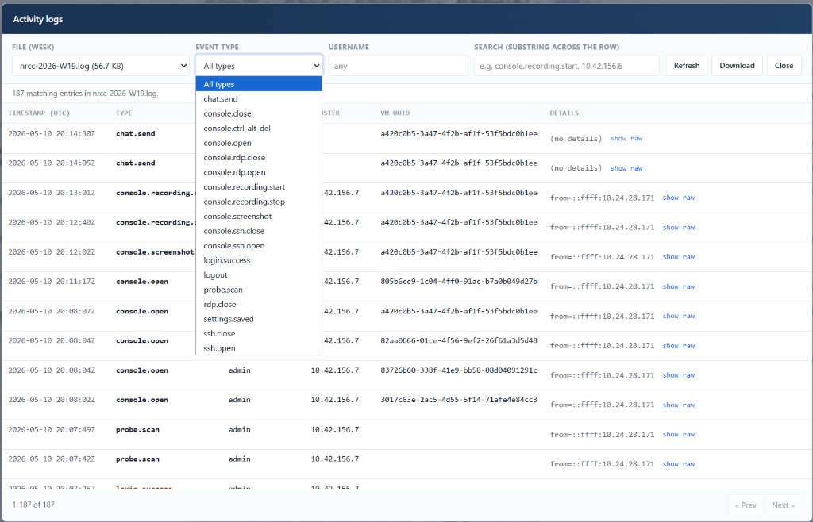

# Nutanix Remote Console Client (NRCC)

A lightweight, browser-based console launcher for **Nutanix VMs and CVMs** that does not require the Prism Central or Prism Element web UI.

NRCC speaks to Nutanix REST APIs (v4 / v3 / v2 / PrismGateway), discovers VMs across one or more clusters, and brokers a noVNC session to the VM through a small Node.js WebSocket proxy. It is purpose-built for lab and operations workflows where you need quick console access to many VMs (including CVMs) from a single tab.

---

## Highlights

- **Prism-Central-style sign-in.** Centered login card asks for the three things you actually need — Prism Central IP, username, password — and nothing else. After login, the page is clean: just the VM list, your consoles, and a logout button in the top right.
- **Background VM loading.** Logging in immediately discovers VMs across all PC-managed clusters in the background. The UI stays fully navigatable while the list streams in.
- **Favorites that survive the wait.** Previously starred VMs are pre-populated in the favorites pane the moment you log in (from a local snapshot), so you can open them before the full VM list has finished loading.
- **Drag-and-drop favorites with folders.** Organize favorites into named folders and sub-folders. Drag VMs between folders, drag folders into other folders, double-click a folder name to rename. Persisted in `localStorage`.
- **Single tab, many consoles.** Browser-style overlapping tabs keep multiple consoles open. Click a tab to switch; click the **×** to close.
- **Show All overview.** A green **Show All** button on the console action bar takes a live screenshot of every open console and lays them out in a grid. Click any tile to switch to that console; click outside the grid (or press <kbd>Esc</kbd>) to dismiss.
- **Wall of Eyes.** A light-blue **Wall of Eyes** button opens a separate browser window that mirrors every open console at ~20 fps in a tightly packed grid (no gaps; any unused space is charcoal black). Click **Full Screen** to slam the wall onto a second monitor or a video wall — perfect for an at-a-glance NOC view of every VM you're babysitting.
- **One-click console actions.** A vertical action bar to the right of the console keeps **Ctrl+Alt+Del**, **Paste**, **Close All**, **Show All**, and **Wall of Eyes** within thumb-reach without crowding the tabs.
- **Clipboard paste that actually works on AHV.** AHV guests don't ship a clipboard-sync agent, so a generic <kbd>Ctrl</kbd>+<kbd>V</kbd> on the VNC channel pastes whatever the *guest* had on its clipboard — not the host's. NRCC's **Paste** button instead types your clipboard into the focused window one keystroke at a time, wrapping shifted and AltGr characters with the right modifiers so symbols like `&` and `@` arrive as `&` and `@` (not `7` and `2`). It paces the keystrokes just enough that a Linux PTY's line discipline can't drop bytes on bursty input — so the same button works on Windows GUIs, Linux logins, terminal sessions, and BIOS/UEFI screens with no clipboard agent required.
- **Per-tab guest keyboard layout.** A small dropdown under the **Paste** button picks which keyboard layout the guest VM is configured for (US QWERTY, UK QWERTY, French AZERTY, German QWERTZ, Spanish, Italian, Brazilian ABNT2, Swedish/Finnish, US Dvorak, US Colemak). Each console tab remembers its own choice; new tabs inherit your most recently used layout (persisted in `localStorage`). This is how `&` lands as `&` on a French AZERTY guest where the US QWERTY assumption would have pasted `1`.
- **VM filtering.** Search by name / UUID / IP and filter by power state.
- **CVM support.** Discovers Controller VMs through the v4 `clustermgmt` API on Prism Central, then redirects the console request to the cluster's Prism Element using the legacy VNC proxy when v4 console-token is unavailable.
- **Per-PE credentials, server-side only.** Prism Central credentials don't authenticate to Prism Element by default. NRCC prompts once per PE, validates with a real probe, and caches the credentials **in the NRCC server process's memory only** — keyed to an `HttpOnly` session cookie. They are never written to browser `localStorage`, never persisted to disk, and disappear when the NRCC server restarts (or after 8 hours of inactivity).
- **Pure HTTP/WebSocket.** No agent on the cluster, no plug-in, no special browser extensions. Self-signed TLS toggle for lab environments.
- **Per-VM screenshots.** A teal **Screenshot** button captures the active console as a PNG and saves it server-side under `screenshots/<vm-uuid>/[<subfolder>/]<ISO-timestamp>.png`. A **Browse...** button opens a thumbnail grid of every saved screenshot for the active VM with breadcrumb folder navigation, **+ Folder** to organize, per-tile open / download / delete actions, and a viewer modal with a single-line **caption editor** that travels with the file as a `<file>.png.json` sidecar. Per-VM retention (default 100, configurable via `NRCC_SCREENSHOT_MAX_PER_VM`) prunes the oldest captures across the whole tree.
- **Per-VM session recording.** A red **Record** button captures the active console as a WebM video (10 fps, VP9 with VP8 fallback) at ~600 kbps. Recording is per-tab, so you can record several VMs in parallel. The button shows a pulsing dot + `mm:ss` elapsed timer; the active console tab gets a matching dot. **Recordings...** opens a per-VM library with the same folder navigator and caption support as screenshots; click a tile to play back via `<video>` (Range-streamed) or download. Defaults are tunable via `NRCC_RECORDING_FPS`, `NRCC_RECORDING_BITRATE`, `NRCC_RECORDING_MAX_BYTES` (500 MB per file), `NRCC_RECORDING_MAX_PER_VM` (50).
- **Global script library.** A round green launcher in the bottom-right corner opens a shared library of plain-text snippets. Organize them into subfolders, **left-click** any script to copy its body to the clipboard (with a legacy `execCommand` fallback for non-secure-context HTTP), **right-click** for **Edit / Rename / Move / Delete**. Per-script size cap defaults to 256 KB (`NRCC_SCRIPT_MAX_BYTES`). Available in both single- and multi-user mode.
- **Multi-user deployment (opt-in).** Set `NRCC_MULTI_USER=true` to flip NRCC into a shared HTTPS deployment with a per-VM real-time chat panel and presence list (in-memory ring buffer of the last `NRCC_CHAT_BUFFER` messages per VM, default 200). A self-signed cert is auto-generated into `./certs/` on first start, with the SHA-256 fingerprint logged for pinning. See [Multi-user deployment](#multi-user-deployment) for the trust model and configuration. Default mode is unchanged single-user HTTP.

---

## Screenshots

A quick visual tour. All shots are from a live multi-user deployment running in dark mode.

### Sign-in

The login card uses your Prism Central credentials and confirms the running build in the footer.



### Main view

Sidebar VM browser (filter, favorites tree, full VM list with power and protocol pills), console tab strip across the top, the section-grouped action menu on the right (Input / Session / Recordings / Manage / View), and the per-VM chat panel docked bottom-right.



### "Show All" grid

One click in the action menu tiles every open console in a single grid view -- handy for keeping multiple lab boxes in sight at once. Click any tile to switch to it, click outside or press Escape to close.



### Per-VM screenshots browser

Per-VM screenshot library with folders, captions, an inline preview pane, and Save / Download / Delete actions. Captures are saved server-side under `NRCC_SCREENSHOTS_DIR` keyed by VM UUID, capped at 100 per VM by default.



### Per-VM recordings browser

Same shape as the screenshots browser but for 10 fps WebM session recordings. Each recording shows duration, size, and the user who captured it; click to play back inline.



### Script library

Click-to-clipboard script library with folders, language tags, and an inline editor. Useful for keeping common admin snippets (Bash, PowerShell, Python, troubleshooting one-liners) one click away from any console you happen to be in.



### Activity logs viewer

Settings → SERVER → **Open logs viewer** opens a dedicated dialog that reads weekly log files directly off the server. Pick a file, filter by event type / username / free-text, paginate, and expand any row to see the raw JSON. Optional download of the filtered view as NDJSON.



---

## Architecture

```
┌──────────┐   localhost   ┌──────────────────────┐    HTTPS / WSS    ┌────────────────────┐
│ Browser  │  ws://3000    │    NRCC server       │ ───────────────▶  │  Prism Central     │
│ (noVNC)  │ ◀──────────── │   (Node + Express)   │                   │  10.x.x.x:9440     │
│          │  HTTP /api/*  │                      │ ───────────────▶  │  Prism Element(s)  │
└──────────┘               └──────────────────────┘                   └────────────────────┘
```

NRCC is two pieces:

### 1. Backend (`server.js`)

A Node.js Express app that:

- **Lists VMs** by paginating Prism Central's `/api/vmm/v4.0/ahv/config/vms` (with `$includeHidden=true`), then enriches the result by probing the cluster-management API (`/api/clustermgmt/v4.x/config/clusters/{id}/cvms`) for Controller VMs that PC's standard list doesn't return.
- **Resolves CVMs to AHV VM UUIDs.** Cluster-mgmt returns CVMs in their own identifier space; that ID is rejected by `generate-console-token` (`VMM-30100`). NRCC matches each CVM back to an AHV VM by IP and name on PE — first via Prism Central, then by falling back to PE's `v3 groups` endpoint, which is the only PE endpoint that reliably returns CVMs alongside user VMs.
- **Generates console tokens** by calling `vmm/v4.x/ahv/config/vms/{uuid}/$actions/generate-console-token` and polling the resulting task. Tries multiple version/action variants for compatibility.
- **Falls back to PE legacy VNC proxy** (`/vnc/vm/{uuid}/proxy`) when Prism Element doesn't expose v4 vmm endpoints. Authenticates with PrismGateway form login or HTTP Basic.
- **Brokers the WebSocket.** The browser opens `ws://localhost:3000/ws-proxy/<id>` and the server proxies bytes to/from the upstream `wss://<prism>:9440/...`, attaching authentication headers server-side. This bypasses cross-site cookie / CORS issues.

### 2. Frontend (`public/`)

Vanilla JS + noVNC, no build step:

- `index.html` — Prism-Central-styled markup, including the sign-in overlay, favorites tree, console tabs, the right-hand action bar (**Ctrl+Alt+Del**, **Paste**, **Close All**, **Show All**, **Wall of Eyes**), the **Show All** grid overlay, and the PE credentials modal.
- `app.js` — login / logout flow, background VM loading, filters, favorites tree with drag-and-drop folders, console tab management, per-console actions (Ctrl+Alt+Del plus a clipboard-typing paste implementation that bypasses the missing AHV clipboard agent), PE credential modal, the screenshot-grid overview, and the popup mirror launcher for the Wall of Eyes window.
- `wall.html` — the standalone page loaded into the Wall of Eyes popup window. It runs same-origin to the main page, reaches back through `window.opener.consoleSessions`, and `drawImage`s every open noVNC `<canvas>` into a single full-window canvas at ~20 fps. An auto-fading toolbar exposes **Full Screen** (Fullscreen API) and **Close**.
- noVNC is served at the URL prefix `/vendor/novnc/`, mapped by `server.js` to `node_modules/@novnc/novnc/` (delivered via the npm package `@novnc/novnc`).

### Console flow

```
┌────────────────────────────┐
│ User clicks Open Console   │
└─────────────┬──────────────┘
              ▼
   ┌──────────────────────┐
   │ POST /api/console-   │ — includes vmUuid, optional peHost / cvmIp / cvmName.
   │   token              │   PE creds are NOT in the body; the server reads
   │                      │   them from its in-memory session map (populated
   │                      │   earlier by POST /api/pe-test).
   └──────┬───────────────┘
          ▼
   ┌──────────────────────────────────────────────────────────────┐
   │ Server: PE branch?                                           │
   │  yes → resolve AHV UUID via PE (v3 groups, hosts, v2/v3 VMs) │
   │      → use legacy /vnc/vm/{uuid}/proxy (Basic auth)          │
   │  no  → call generate-console-token on PC, poll task,         │
   │        extract WS path + token                               │
   └──────┬───────────────────────────────────────────────────────┘
          ▼
   ┌──────────────────────┐
   │ Returns websocketUrl │ → ws://localhost:3000/ws-proxy/<id>
   └──────┬───────────────┘
          ▼
   ┌──────────────────────────────────────────────┐
   │ Browser opens noVNC → server proxies bytes   │
   │ to wss://<prism>:9440/... with stored auth   │
   └──────────────────────────────────────────────┘
```

---

## Quickstart

The fastest way to get NRCC running on a fresh machine is one copy/pasteable line. The script auto-detects whether **Docker** is installed (preferred — RDP works out of the box because it brings up `guacd` as a sidecar) and otherwise falls back to a **Node.js source install** under your home directory. In both cases it ends with:

- a `nrcc` command on your PATH (subcommands: `start`, `stop`, `status`, `logs`, `open`, `upgrade`, `enable-service`, `uninstall`),
- a desktop / Start Menu icon that starts NRCC and opens the browser,
- the browser opened to <https://localhost:8443>.

> The TLS cert is self-signed; click through the browser warning once. Nothing is installed system-wide and no `sudo` / Administrator prompt is required for the default install.

### Linux

```bash
curl -fsSL https://raw.githubusercontent.com/script-repo/ntnx-console-client/main/install.sh | bash
```

### macOS

```bash
curl -fsSL https://raw.githubusercontent.com/script-repo/ntnx-console-client/main/install.sh | bash
```

### Windows (PowerShell)

```powershell
iwr -useb https://raw.githubusercontent.com/script-repo/ntnx-console-client/main/install.ps1 | iex
```

### After install

```bash
nrcc                    # start (if needed) and open the browser
nrcc status             # is it running?
nrcc logs               # tail server logs
nrcc upgrade            # pull a newer build
nrcc enable-service     # opt-in: register autostart at login
nrcc uninstall          # stop everything and remove the install
```

### Override the defaults (optional)

| Variable                | Default                                                               | Purpose                                  |
| ----------------------- | --------------------------------------------------------------------- | ---------------------------------------- |
| `NRCC_INSTALL_DIR`      | `~/.nrcc` (POSIX) / `%LOCALAPPDATA%\NRCC` (Windows)                   | Where the install lives                  |
| `NRCC_BIN_DIR`          | `~/.local/bin`                                                        | Where the `nrcc` launcher symlink goes (POSIX) |
| `NRCC_BRANCH`           | `main`                                                                | Git branch / image tag to track          |
| `NRCC_FORCE_METHOD`     | _auto_                                                                | `docker` or `source` to skip detection   |
| `NRCC_PORT`             | `8443`                                                                | Host port to publish                     |
| `NRCC_NO_OPEN`          | _unset_                                                               | Set to `1` to skip launching the browser |

To uninstall later, run `nrcc uninstall` (or re-fetch and pipe the matching `uninstall.sh` / `uninstall.ps1`).

> **RDP / SSH note:** The Docker install ships a `guacd` sidecar so RDP and SSH consoles work immediately. The source install does **not** install `guacd`; follow the per-OS instructions in [Beta: VM port scan + SSH / RDP consoles](#beta-vm-port-scan--ssh--rdp-consoles) below.

For the manual / developer flow (clone the repo, `npm install`, run from source), keep reading.

---

## Installation

### Prerequisites

- **Node.js 18+** (tested on Node 20 and 22).
- **Network access** from the machine running NRCC to the Prism Central host on port 9440 and, optionally, to each Prism Element on port 9440 (for CVM consoles).
- A **Prism Central account** with `Generate_VM_Console_Token` permission (typically `Cluster Admin` or `Super Admin`).
- A **Prism Element account** if you intend to open CVM consoles. PE has its own user database; PC credentials do not federate.
- **Optional, for the RDP browser console (beta):** the `guacd` daemon installed natively (no container required). Ubuntu/Debian `apt install guacd`, RHEL family `dnf install guacd`, macOS `brew install guacamole-server`. See **Beta: VM port scan + SSH / RDP consoles** below.

### Install

```bash
git clone <this-repo>
cd ntnx-console-client
npm install
```

### Configure (optional)

```bash
copy .env.example .env       # Windows
# or: cp .env.example .env   # macOS/Linux
```

`.env` keys (all optional — values entered in the UI take precedence):

| Key                       | Default            | Description                                                                                            |
| ------------------------- | ------------------ | ------------------------------------------------------------------------------------------------------ |
| `PORT`                    | `3000`             | Local HTTP port.                                                                                       |
| `NUTANIX_PC_HOST`         | _empty_            | Default Prism Central IP / hostname.                                                                   |
| `NUTANIX_USERNAME`        | _empty_            | Default PC username.                                                                                   |
| `NUTANIX_PASSWORD`        | _empty_            | Default PC password.                                                                                   |
| `NUTANIX_TLS_SKIP_VERIFY` | `true`             | Accept self-signed Prism certs (lab default).                                                          |
| `NUTANIX_API_TIMEOUT_MS`  | `30000`            | Per-request timeout (ms) for outbound calls to Prism. Increase if VM listing times out against a slow PC. |
| `NRCC_LOGGING`            | `false`            | Master switch for activity logging. When `true`, NRCC writes login / console-open / console-close / chat events (and any client-emitted activity, when the per-user toggle is on) to a weekly-rotated file. |
| `NRCC_LOGS_DIR`           | `./logs`           | Directory for the weekly log files (`nrcc-YYYY-Www.log`). Created on first start when `NRCC_LOGGING=true`. |
| `NRCC_LOG_RETENTION_DAYS` | `30`               | Default automatic-pruning window for the weekly log files. Files older than this many days (by mtime) are deleted by a sweep that runs every 6 hours. `0` disables pruning entirely (keep forever). The Settings → SERVER section can override this at runtime; the chosen value is persisted to `NRCC_SERVER_CONFIG_PATH` and survives pod restarts. |
| `NRCC_SERVER_CONFIG_PATH` | `<dirname(NRCC_LOGS_DIR)>/nrcc-server-config.json` | File where the runtime-tunable server config (currently `logRetentionDays`) is stored. The default puts it next to the data directories so it survives pod restarts on the same PVC. |
| `NRCC_UPDATE_ENABLED`     | `true`             | Master switch for the in-app **Update** button (Settings → Build). Set to `false` on locked-down installs to hide the button and refuse `/api/update/*` calls. |
| `NRCC_UPDATE_REPO`        | `https://github.com/script-repo/ntnx-console-client` | GitHub repo (HTTPS clone URL) the updater fetches `build.info` from and clones / pulls. |
| `NRCC_UPDATE_BRANCH`      | `main`             | Branch the updater compares against and resets / clones to. |
| `NRCC_UPDATE_CHECK_TTL_MS`| `300000` (5 min)   | Cache TTL for `/api/update/check` results. Multiple users sharing the install and the per-client background poll all share this cache so `raw.githubusercontent.com` is hit at most once per TTL window. The Update button bypasses the cache via `?force=1`. Minimum 60 000 ms. |
| `NRCC_PROBE_ENABLED`      | `true`             | **Beta.** Master switch for the VM port-scan endpoint (`/api/probe/ports`). Set to `false` to hide SSH/RDP availability pills and refuse the probe / SSH-start endpoints. |
| `NRCC_PROBE_PORTS`        | `22,3389`          | **Beta.** Comma-separated TCP ports the probe attempts per VM IP. Future-proofed for additions like `5985` (WinRM); keep narrow to limit probe noise. |
| `NRCC_PROBE_TIMEOUT_MS`   | `2000`             | **Beta.** Per-socket connect timeout for each probe dial (ms). |
| `NRCC_PROBE_CONCURRENCY`  | `20`               | **Beta.** Global semaphore over `(vm, ip, port)` tuples; prevents 200 VMs × 2 ports × 4 IPs from dialling all at once. |
| `NRCC_PROBE_CACHE_TTL_MS` | `120000` (2 min)   | **Beta.** How long a per-VM probe result is reused before the next request triggers a re-probe. Also bounds the SSH SSRF allow-list lifetime. |
| `NRCC_PROBE_MAX_IPS_PER_VM`| `4`               | **Beta.** Cap on IPs probed per VM (multi-NIC VMs commonly expose 2-3). |
| `NRCC_SSH_ENABLED`        | `true`             | **Beta.** Master switch for the browser-side SSH console. Set to `false` to refuse `/api/ssh/start` and the `/ws-ssh/<id>` upgrade. |
| `NRCC_SSH_IDLE_TIMEOUT_MS`| `900000` (15 min)  | **Beta.** How long an unused SSH session id is kept (the WS upgrade typically arrives within seconds; this only protects against orphaned `start` calls). |
| `NRCC_SSH_MAX_SESSIONS`   | `64`               | **Beta.** Hard cap on simultaneous SSH sessions per server process. |
| `NRCC_SSH_READY_TIMEOUT_MS`| `15000`           | **Beta.** How long `ssh2` waits for the remote handshake before giving up. |

### Run

NRCC has one start command (`npm start`) and one feature toggle (`NRCC_MULTI_USER`). The same binary serves both modes; the environment decides which.

#### Single-user mode (default — HTTP on `localhost`)

```bash
npm start
```

Then open <http://localhost:3000>.

#### Multi-user mode (HTTPS, per-VM chat + presence)

Pick whichever shell syntax matches your platform:

```bash
# macOS / Linux (bash, zsh)
NRCC_MULTI_USER=true npm start
```

```powershell
# Windows PowerShell
$env:NRCC_MULTI_USER='true'; npm start
```

```cmd
:: Windows cmd.exe
set NRCC_MULTI_USER=true && npm start
```

Or persist it in `.env` (cross-platform; `dotenv` is loaded at startup):

```env
NRCC_MULTI_USER=true
```

Then `npm start` as usual. Open <https://localhost:3000> (note **https**) and accept the self-signed cert warning the first time. The startup log prints the cert's SHA-256 fingerprint so you can pin / verify it from the browser's "view certificate" pane.

See [Multi-user deployment](#multi-user-deployment) for the optional companion env vars (`NRCC_TLS_*`, `NRCC_CHAT_BUFFER`, `NRCC_SCREENSHOTS_DIR`, `NRCC_SCREENSHOT_MAX_PER_VM`) and the trust-model caveats.

---

## Usage

1. Open <http://localhost:3000>. The Prism-Central-style **Sign in** card appears.
2. Enter your **Prism Central IP**, **username**, and **password**. Tick **Allow self-signed TLS** for lab environments and **Include hidden / system VMs** if you want CVMs in the list. Tick **Remember host and username** if you want NRCC to repopulate those two fields next time (the password is never stored).
3. Click **Sign in**. NRCC validates the credentials by listing VMs; on success the login overlay disappears and the main UI is shown. Your previously starred favorites are visible in the sidebar **immediately** — even before the full VM list finishes loading — so you can open a familiar console right away.
4. The full VM list streams in the background. The whole UI stays interactive during loading.
5. Search by name / IP / UUID, filter by power state, and click the **★** to favorite a VM.
6. Drag favorites between **folders**. Click **+ Folder** to create a top-level folder, click the **+** on a folder header to create a sub-folder, click the folder name to rename, and click **×** to delete it (its contents move up to the parent — your favorited VMs are not lost).
7. **Click a VM** to open its console. The session opens in a new tab.
   - For regular VMs the console opens immediately via PC's v4 token flow.
   - For CVMs, NRCC prompts once for **PE credentials** (per cluster). The credentials are validated with a probe and cached in the NRCC server's memory for the session — never in the browser, never on disk. To wipe them, click **Forget PE credentials** in the top right (or restart the NRCC server).
8. With multiple consoles open, click the green **Show All** button to the right of the tab strip to see a live screenshot of every console at once. Click any tile to jump to that console; click outside the grid (or press <kbd>Esc</kbd>) to close it.
9. For a continuously-updating overview, click the light-blue **Wall of Eyes** button (under **Show All**). NRCC opens a new browser window that mirrors every open console live at ~20 fps in a tightly packed grid. Click **Full Screen** in the wall window's toolbar to push it to a dedicated monitor; charcoal-black fills any unused space.
10. Click **Logout** in the top right when you're done. NRCC wipes the in-memory PC credentials and closes every open console.

### Keyboard shortcuts and console actions

- The right-hand action bar exposes **Ctrl+Alt+Del**, **Paste**, and a **Guest keymap** dropdown for the active tab.
- **Paste** types your clipboard into the focused guest window one keystroke at a time, wraps shifted and AltGr characters in the right modifiers so symbols like `&!@#$%^*()_+{}|:"<>?~` arrive correctly, and paces the keystrokes just enough that a Linux PTY's line discipline can't drop bytes on bursty input. The same button works for Windows GUIs, Linux logins, terminal sessions, and BIOS/UEFI screens with no clipboard-sync agent required.
- The **Guest keymap** dropdown selects the keyboard layout the guest VM is configured for. Supported layouts:
  - **US QWERTY** (`en-us`, the AHV default)
  - **UK QWERTY** (`en-gb`)
  - **French (AZERTY)** (`fr-FR`) — `@`, `#`, `{`, `}`, `[`, `]`, `\`, `|`, `~`, `` ` `` and `^` are reached via AltGr.
  - **German (QWERTZ)** (`de-DE`) — `Y`/`Z` swap, AltGr layer for `@`, `\`, `|`, brackets and `~`.
  - **Spanish** (`es-ES`)
  - **Italian** (`it-IT`)
  - **Brazilian ABNT2** (`pt-BR`)
  - **Swedish / Finnish** (`sv-SE` / `fi-FI`) — Norwegian and Danish are 99 % identical and can use this option for everyday characters; the only differences are the `Ø/Å` and `Æ/Ø` swaps.
  - **US Dvorak**
  - **US Colemak**
- The selector is **per console tab**, so a French VM and an English VM can be open at the same time with independent layouts. New tabs inherit the most recently used selection (persisted in `localStorage` under `ntnxConsoleLastKeymap`).
- The selector matches the **guest's** keyboard layout, not your host workstation's. Your host layout is irrelevant — `navigator.clipboard` returns Unicode regardless of what physical keys you used to copy the text.
- Characters that aren't in the chosen layout's table (random Unicode, emoji, CJK, accented letters reachable only via dead keys) are sent as raw X11 keysyms with no modifier wrapping. Most Linux guests with the right xkb keymap accept these; Windows guests usually don't, in which case those characters are skipped and the status bar reports the count.
- Paste also seeds the VNC clipboard via `clipboardPasteFrom`, so guests that *do* have a clipboard agent can use the host clipboard normally as well.
- <kbd>Esc</kbd> closes the **Show All** grid overlay.
- In the **Wall of Eyes** popup window, <kbd>Esc</kbd> exits browser fullscreen (the standard Fullscreen API behaviour); the toolbar (with **Full Screen** and **Close**) auto-fades after ~2.5 s of mouse-idle while in fullscreen and reappears on any movement.

---

## Settings

After signing in, the **gear icon** in the top right opens a settings dialog with four per-browser preferences. All four are stored in `localStorage` under the key `nrcc.userPrefs.v1` and apply immediately when you click **Save**.

| Setting                     | Options                       | Default     | Notes |
| --------------------------- | ----------------------------- | ----------- | ----- |
| **Theme**                   | Light, Dark, Match system     | Light       | Sets `data-theme` on `<html>`; the CSS variables in `index.html` swap palette accordingly. **Match system** follows `prefers-color-scheme` and re-evaluates if the OS theme changes while the page is open. |
| **Auto-logout after inactivity** | 15 min, 1 hour, Never    | 15 min      | When idle for the chosen interval, NRCC clears in-memory PC credentials, closes every open console tab, and returns to the sign-in screen. Activity is detected from `mousemove` / `keydown` / `mousedown` / `wheel` / `touchstart` (capture phase, so console keystrokes also count). |
| **Record my logins and console activity** | on / off       | off         | Per-user opt-in for activity logging. Greyed out unless `NRCC_LOGGING=true` is set on the server. When on, the client adds `?clientLogging=1` to its `POST /api/log` calls; the server only honours requests that carry that query parameter. |
| **Show beta features**      | on / off                      | off         | Reveals UI elements marked as beta in the feature-flag registry (see **Feature flags**). All current features are GA, so this toggle is a no-op until a beta feature is shipped. |

### Activity logging

When `NRCC_LOGGING=true` is set on the server (and the per-user toggle is on for client events), NRCC writes one JSON record per line to a weekly-rotated file:

```
${NRCC_LOGS_DIR or ./logs}/nrcc-YYYY-Www.log
```

Each record is a single JSON object:

```json
{
  "ts": "2026-05-09T20:14:11.482Z",
  "type": "console.open",
  "username": "alice",
  "sessionId": "<uuid>",
  "pcHost": "10.38.66.7",
  "vmUuid": "11111111-2222-3333-4444-555555555555",
  "remoteIp": "10.42.156.18",
  "details": { "via": "pc:10.38.66.7" }
}
```

Server-emitted event types (always written when the master switch is on):

| Type                 | When                                                                 |
| -------------------- | -------------------------------------------------------------------- |
| `login.success`      | `/api/pc-test` accepted the credentials.                             |
| `login.rejected`     | `/api/pc-test` returned 401.                                          |
| `login.unreachable`  | No probe responded (PC unreachable / wrong host).                    |
| `logout`             | `/api/logout`.                                                       |
| `console.open`       | `/api/console-token` produced a websocket URL.                       |
| `console.close`      | The /ws-proxy WebSocket was torn down (includes `durationMs`).      |
| `chat.send`          | Multi-user chat message broadcast.                                   |
| `probe.scan`         | **Beta.** `/api/probe/ports` issued at least one new probe (cached results don't log). Includes `vmCount`, `scannedNow`, `ports`. |
| `ssh.open`           | **Beta.** ssh2 client reached `ready` for an SSH tab. Includes `host`, `port`, `sshUser`. |
| `ssh.close`          | **Beta.** SSH tab closed (server-side or WS torn down). Includes `durationMs`, `reason`. |

Client-emitted event types (require **both** `NRCC_LOGGING=true` and the per-user toggle):

| Type                       | When                                          |
| -------------------------- | --------------------------------------------- |
| `console.paste`            | Paste finished typing into the console.       |
| `console.ctrl-alt-del`     | Ctrl+Alt+Del button.                          |
| `console.screenshot`       | Screenshot saved.                             |
| `console.recording.start`  | Recording started.                            |
| `console.recording.stop`   | Recording finished and saved.                 |
| `console.script.copy`      | A script tile was copied to the clipboard.    |
| `settings.saved`           | Settings dialog saved.                        |
| `console.ssh.open`         | **Beta.** Browser-side SSH WebSocket reached `ready`. |
| `console.ssh.close`        | **Beta.** Browser-side SSH WebSocket closed (includes `code` or `reason`). |

The file is append-only with one line per event; the filename rotates weekly. NRCC also runs an automatic retention sweep every 6 hours -- any file under `NRCC_LOGS_DIR` whose `mtime` is older than `logRetentionDays` is deleted. The default is **30 days**; operators can set a different baseline with `NRCC_LOG_RETENTION_DAYS=N` (`N=0` disables pruning entirely) and any signed-in user can change the live value from **Settings → SERVER → Log retention (days)**. The chosen value is persisted to `NRCC_SERVER_CONFIG_PATH` (default: `nrcc-server-config.json` next to the data directories) so it survives pod restarts.

### Activity log viewer

Settings → SERVER → **Open logs viewer** opens a dedicated dialog that reads log files directly off the server (no `kubectl exec` required):

- **File picker.** Lists every `nrcc-YYYY-Www.log` file in `NRCC_LOGS_DIR`, newest first, with size in KB. Selecting a different file reloads the table.
- **Filters.** Event-type dropdown (auto-populated from the file's distinct types), username substring match, and free-text search across the raw JSON. Filters debounce so typing doesn't fire a request per keystroke.
- **Table.** Timestamp, type, user, cluster (`pcHost`), VM UUID, and a compact details summary. Each row has an inline **show raw** toggle that reveals the full JSON for the entry.
- **Pagination.** 200 rows per page; the footer shows the matching range out of the filtered total.
- **Download.** Saves the currently selected file (filtered by the active filters, capped at the first 10 000 entries) as NDJSON for offline analysis.

The viewer hits two endpoints, both gated on a logged-in session:

```
GET /api/logs/files
GET /api/logs?file=<name>&offset=<n>&limit=<n>&type=<t>&user=<u>&q=<text>&order=<asc|desc>
```

`file` is validated against `^nrcc-[A-Za-z0-9_-]+\.log$` so the endpoint can never read arbitrary paths.

### Feature flags

NRCC keeps a small feature-flag registry in `server.js` (`FEATURE_FLAGS`) that the server publishes via `GET /api/config`. Each flag carries a `stage` of `"ga"` or `"beta"`:

```javascript
const FEATURE_FLAGS = {
  chat:        { stage: "ga", description: "Multi-user VM chat panel" },
  screenshots: { stage: "ga", description: "Per-VM screenshot capture and library" },
  recordings:  { stage: "ga", description: "Per-VM video recording (10 fps WebM)" },
  scripts:     { stage: "ga", description: "Global script library with click-to-clipboard" },
  logging:     { stage: "ga", description: "Optional activity logging (server-gated)" },
  settings:    { stage: "ga", description: "User preferences dialog (theme, idle timeout)" },
  vmPortScan:  { stage: "beta", description: "Auto-probe VM IPs for SSH/RDP availability" },
  sshConsole:  { stage: "beta", description: "Open SSH session as a console tab (xterm.js)" },
  rdpConsole:  { stage: "beta", description: "Open RDP session as a console tab (Guacamole HTML5; needs guacd)" }
};
```

Conventions:

- **All previously-shipped features are GA**; only the three beta entries above are gated.
- A new feature lands as `{ stage: "beta" }`. UI elements that are only meaningful when the feature is on get a `data-feature="<id>"` attribute. The client's `featureFlags.refresh()` hides those elements unless `userPrefs.betaFeaturesEnabled` is true.
- Code paths that aren't tied to a single DOM element can call `featureFlags.isEnabled("<id>")` to gate themselves.
- Promote a feature to GA by changing `stage` to `"ga"` in the registry. Beta-only `data-feature` markers can stay; `featureFlags.refresh()` will simply leave them visible.

### Beta: VM port scan + SSH / RDP consoles

Three beta features (`vmPortScan`, `sshConsole`, and `rdpConsole`) work together so a user can open an SSH or RDP session straight from the VM list, in a tab that behaves like any other console tab (screenshots and recordings included). All surfaces are hidden by default and only render after the user toggles **Show beta features** in Settings AND the operator has left the corresponding `NRCC_*_ENABLED` env var on.

**vmPortScan** — after the VM list arrives the client batches the IPs to `POST /api/probe/ports`, in groups of 50, debounced 500 ms. The server TCP-dials each `(vm, ip, port)` tuple (default `22` and `3389`) under a global semaphore (`NRCC_PROBE_CONCURRENCY`, default 20) and caches the result for `NRCC_PROBE_CACHE_TTL_MS` (default 2 min). Open ports surface as small **SSH** / **RDP** pills next to the existing power-state pill in each VM row.

**sshConsole** — when the probe saw `22/tcp` open AND `sshConsole` is enabled, a new **Open SSH** entry appears in the right-click menu. The first time it's used per VM the user is prompted for credentials (username + password OR private key + passphrase) and may tick **Remember for this browser session**; remembered creds live in browser memory only and are wiped on logout. The SSH session itself flows through:

1. `POST /api/ssh/start` validates the host against the per-VM probe cache (the SSRF guard) and allocates a single-use session id.
2. The browser opens `/ws-ssh/<id>`; the server accepts the upgrade exactly once, deletes the session entry, and pipes raw bytes between the WebSocket and `ssh2.Client.shell()` running with `xterm-256color`.
3. The browser renders the stream with [`xterm.js`](https://github.com/xtermjs/xterm.js) and its WebGL renderer, which publishes a single `<canvas>` into the same console pane noVNC would otherwise own. The existing screenshot and recording pipelines pick that canvas up automatically.
4. Resize is debounced 80 ms (`ResizeObserver` on the pane → `fitAddon.fit()` → `{type:"resize", cols, rows}` text frame → `stream.setWindow()`).

**rdpConsole** — when the probe saw `3389/tcp` open AND `rdpConsole` is enabled, an **Open RDP** entry appears in the right-click menu (purple icon, alongside the green SSH one). The first time it's used per VM the user is prompted for credentials (username + password, optional domain, security mode, ignore-cert checkbox) and may tick **Remember for this browser session**. The RDP session itself flows through:

1. `POST /api/rdp/start` validates the host against the per-VM probe cache (the same SSRF guard SSH uses) and allocates a single-use session id. The browser also reports its actual screen-pane size so guacd produces a correctly-sized framebuffer from the very first frame.
2. The browser opens `/ws-rdp/<id>`; the server accepts the upgrade exactly once, deletes the session entry, and TCP-connects to a locally-installed `guacd` on `NRCC_GUACD_HOST:NRCC_GUACD_PORT` (default `127.0.0.1:4822`).
3. The server runs the Guacamole protocol handshake: `select,rdp;` → reads `args,VERSION_X_Y_Z,...;` → replies with `size`, `audio`, `video`, `image`, `timezone`, then `connect,...` filling each parameter slot from the cached credentials in the order guacd dictated. From that point it is a byte pump between the WebSocket and the TCP socket.
4. The browser uses [`guacamole-common-js`](https://www.npmjs.com/package/guacamole-common-js) to render the protocol stream onto a stack of `<canvas>` elements. A parallel 2D capture canvas is updated from `display.flatten()` so the existing screenshot and recording pipelines work transparently.
5. Resize is debounced 120 ms (`ResizeObserver` on the pane → `client.sendSize(w, h)` + `display.scale(...)`); the negotiated `resize-method` is `display-update` so guests that support it produce a fresh framebuffer at the new size.
6. RDP tabs are coloured **purple** in the tab strip, alongside the **green** SSH tabs and the default **blue** VNC tabs, so the protocol is obvious at a glance.

**Installing `guacd` natively (no container required)**

`guacd` is the Apache Guacamole proxy daemon. NRCC does **not** bundle it and does **not** require a container — you install it the same way you'd install any other system service:

```bash
# Ubuntu / Debian
sudo apt install guacd

# RHEL / Rocky / Alma / Fedora
sudo dnf install guacd

# macOS (Homebrew)
brew install guacamole-server
brew services start guacamole-server

# Verify it's listening on 127.0.0.1:4822
ss -ltn | grep 4822    # or: lsof -iTCP:4822 -sTCP:LISTEN
```

If `guacd` lives on a different host or port, point NRCC at it with `NRCC_GUACD_HOST` / `NRCC_GUACD_PORT`. Connection failures surface in the browser as a Guacamole `error` instruction (status `519` / `UPSTREAM_NOT_FOUND`) so an operator who forgets to start the daemon gets a clear message instead of a silent hang.

**Caveats**

- **No SSH host-key pinning yet.** v1 accepts any host key; the IP allow-list (RFC1918 + probe cache) is the primary defence. Host-key TOFU prompts will land in a follow-up.
- **RDP TLS verification defaults off.** `NRCC_RDP_IGNORE_CERT=true` (the lab default) tells `guacd` to accept any certificate the RDP host presents. Set it to `false` once you have a real PKI in place.
- **L3 reachability required.** The NRCC server (or pod) must be able to TCP-dial the VM IPs directly. In Kubernetes deployments this means the pod needs network policy that permits egress to the VM subnet. RDP additionally needs `guacd` reachable on the same host or the network in between.
- **Probe noise.** 2 ports × 4 IPs × N VMs is bounded by `NRCC_PROBE_CONCURRENCY` and cached for `NRCC_PROBE_CACHE_TTL_MS`. Disable per env var (`NRCC_PROBE_ENABLED=false`) if a SOC complains; the SSH and RDP endpoints both refuse to start a session without a fresh probe entry, so disabling the probe also disables both.
- **Process-memory state.** SSH / RDP session metadata and the probe cache live in process memory only. A self-update restart wipes both — same caveat as the chat history.
- **xterm renderer only paints on activity** so `canvas.captureStream(10)` produces a sparse video. MediaRecorder still encodes it correctly; recorded SSH files are tiny relative to a busy VNC tab. The RDP recording path uses the same per-fps capture tick so a static guest desktop still produces a smooth playback file.
- **Audio / printer / drive redirection are off.** The `audio`/`video` capability arrays we send to guacd are empty, and the connect parameters explicitly disable printer / drive sharing. The browser console is rendering-only.

---

## Versioning

NRCC uses a date-stamped, daily-counter build identifier:

```
Major.Minor.Patch-YYYYMMDD-NN
```

For example, `0.5.0-20260509-01` is the **first build** of `0.5.0` cut on **9 May 2026**. Cut a second build the same day and it becomes `0.5.0-20260509-02`. The first build the next day rolls the date and resets the counter (e.g. `0.5.0-20260510-01`).

The active build is shown:

- in the **NRCC startup log** (`NRCC 0.5.0-20260509-01 running at http://localhost:3000`),
- in the **Settings dialog footer** (gear icon in the top right),
- in `GET /api/config` as `appVersion`,
- in `package.json` as the canonical `version` field,
- in `build.info` at the repo / install root, as a single trimmed line. This is the file the in-app updater reads from GitHub.

The server prefers `build.info` when both files exist, so a self-update that swaps the file tree without re-running `npm install` still reports the correct version.

### Cutting a new build

A small helper bumps the counter in `package.json` so the three surfaces above stay in sync from a single edit:

```bash
npm run bump-build              # roll today-NN (or 01 if today's date isn't yet present)
npm run bump-build -- --patch   # bump patch, then today-01
npm run bump-build -- --minor   # bump minor, zero patch, then today-01
npm run bump-build -- --major   # bump major, zero minor + patch, then today-01
npm run bump-build -- --set 0.6.0-20260512-03   # set explicitly
```

The script edits `package.json` in place and prints `bump-build: <old> -> <new>`; it does **not** create a git commit. Wrap it in your release flow if you want a tagged commit, e.g.:

```bash
npm run bump-build -- --patch
git add package.json
git commit -m "Release $(node -p "require('./package.json').version")"
git tag "v$(node -p "require('./package.json').version")"
```

### Convention

- Bump **patch** for bug fixes that don't change behavior.
- Bump **minor** for new features that are backwards-compatible.
- Bump **major** for breaking changes (API renames, removed env vars, etc.).
- Cut a fresh **build** (`-NN` increment) for any rebuild of the same source on the same day, even if the patch level is unchanged. This is what differentiates two pushes of the same hotfix.

### Self-update

A blue **Update** button sits beside the build number in the Settings dialog, and a small blue dot appears on the gear icon in the top-right whenever the background poll detects a newer build on GitHub. Clicking the button:

1. `POST /api/update/check?force=1` — server fetches `build.info` from `<NRCC_UPDATE_REPO>/<NRCC_UPDATE_BRANCH>` over `raw.githubusercontent.com` and compares it to the running `APP_VERSION`.
2. If you are already on the latest build, an inline confirmation appears (**“You are running the latest build!”**) and nothing else happens.
3. If a newer build exists, NRCC asks you to confirm the upgrade. On Yes it sends `POST /api/update/install`, the server replies `202 Accepted`, and the upgrade runs in the background. The browser polls `/api/health` until the server comes back, then reloads the page.

The gear-icon badge is driven by an automatic background probe that runs every 30 minutes (with an initial probe ~5 s after login). The probe shares the server-side cache (`NRCC_UPDATE_CHECK_TTL_MS`, default 5 min) so multiple users open in the same install don't multiply the GitHub fetches. The dot disappears as soon as you complete the upgrade and `APP_VERSION` catches up.

Two upgrade strategies are auto-selected:

- **In-place git** (default when `<install>/.git` exists): the server runs `git fetch --depth 1 origin <branch>` followed by `git reset --hard origin/<branch>`. The working tree is reset to match the remote tip exactly, so any local edits to repo-tracked files are discarded — preserve them in a fork or a branch first.
- **Clone-and-swap** (when there is no `.git` directory, e.g. inside a `kubectl cp`-deployed pod): the server runs `git clone --depth 1 --branch <branch> <repo> <tmpdir>` and then copies each top-level entry from `<tmpdir>` over the install dir, **skipping** anything in the preserve list (`logs/`, `recordings/`, `screenshots/`, `scripts/`, `certs/`, `node_modules/`, `.env`, `build.info`). The fresh `build.info` is then copied across so the version stamp matches what just landed.

Both strategies are followed by a dependency re-resolve and `process.exit(0)`. The dependency step prefers `npm ci --omit=dev` when a `package-lock.json` is present (it deletes `node_modules/` and rebuilds from the lockfile exactly — fastest and safest after a full file swap) and falls back to `npm install --omit=dev` when there is no lockfile. **A process supervisor must restart the node process** (PM2, systemd, a Kubernetes Deployment with `restartPolicy: Always`, etc.) — `npm start` invoked directly in a terminal will simply exit.

Prerequisites:

- `git` must be on the server's `PATH`.
- The user that runs `node server.js` needs write access to the install directory (and to `node_modules/`, where `npm install` writes).
- The host must have outbound HTTPS access to `github.com` and `raw.githubusercontent.com`.

#### Kubernetes caveat

Inside an ephemeral pod, the upgraded files live on the container's writable layer. `process.exit(0)` triggers the kubelet to start a **new** pod from the **original** image, throwing the upgraded files away. To make self-update stick in Kubernetes, mount the install directory on a `PersistentVolumeClaim` (the cluster used in this project's manifests already does this for `/app`). Without a PVC the Update button will appear to succeed and the build number will then revert to whatever ships in the image.

#### Auth and rollback

- Any logged-in user can trigger an upgrade. This matches the rest of the multi-user trust model (everyone in the room is an admin).
- Rollback is not built in. If a bad build ships, push a fix and run the upgrade again, or roll the Kubernetes Deployment back manually. NRCC does not snapshot the previous tree.
- The server refuses concurrent upgrades; a second click while one is in flight returns `409 Conflict`.

To disable the feature entirely (e.g. on a locked-down install), set `NRCC_UPDATE_ENABLED=false`. The Update button is hidden and `/api/update/check` and `/api/update/install` return `503 Service Unavailable`.

---

## Use cases

- **Lab and test environments** — quickly bounce between consoles on multiple clusters without juggling Prism browser tabs.
- **Pre-staging VMs** — connect to brand-new VMs before they have any guest agent or RDP/SSH service.
- **Recovering misconfigured network** — a VM whose NIC was misconfigured can still be reached over the AHV console.
- **CVM diagnostics** — open a CVM console to check boot status without first SSH'ing in (useful when an SSH key is rotated or the CVM is hung in early boot).
- **Multi-tenant ops** — a single dev workstation can hold authenticated sessions to several Prism Elements at once.
- **NOC / video-wall view** — drop the **Wall of Eyes** popup onto a second monitor or a TV in fullscreen mode and watch every console you've opened update in real time during a maintenance window or upgrade.

---

## Caveats and limitations

### CVM listing is asymmetrical

Prism Central exposes Controller VMs only via `clustermgmt/v4.x/config/clusters/{cluster}/cvms`, and not via the standard AHV VM list. The CVM `extId` returned there is **not** the AHV VM UUID — passing it to `generate-console-token` returns `VMM-30100 VM not found`. NRCC works around this by:

1. Stamping each CVM with its cluster's external IP (`peHost`).
2. On Connect, resolving the actual AHV VM UUID by querying PE's `v3 groups` endpoint (`entity_type: "vm"`), which is the only PE endpoint that returns CVMs alongside user VMs.

If your PE has the v4 vmm API exposed, NRCC will use the standard `generate-console-token` flow against PE. If not, it falls back to the legacy `/vnc/vm/{uuid}/proxy` WebSocket — the same endpoint Prism Element's own UI uses.

### Prism Central credentials don't authenticate to Prism Element

PC and PE have separate user databases. PC's `admin` is not automatically a PE user. NRCC will prompt for PE credentials the first time you open a CVM on a given PE, validate them with a real probe (`PrismGateway/services/rest/v2.0/cluster`), and cache them in the NRCC server's in-memory session map (keyed to an `HttpOnly` cookie). Use the **Cancel** button in the modal to abort.

### Network reachability

Your browser talks only to NRCC on `localhost:3000`, but **the NRCC server must be able to reach Prism on port 9440**. Most enterprise networks block 9440 between subnets — run NRCC on a host that already has Prism connectivity (e.g., your jump host).

### Wall of Eyes is a same-origin browser popup

The Wall of Eyes window is a regular `window.open("/wall.html", ...)` popup of the main NRCC tab. There is no separate server-side stream; the popup paints by reaching back through `window.opener.consoleSessions` and reading each session's noVNC `<canvas>` directly. That means:

- **Same browser only.** The wall has to live in the same browser profile as the main NRCC tab. You can't, for example, open `wall.html` in a different browser and have it find the consoles — there's no `window.opener` to read from.
- **Don't close the main tab.** If the main NRCC tab is closed, refreshed, or logged out, every open console disconnects and the wall window switches to a "Disconnected" empty state. Reopen the main tab and click **Wall of Eyes** again.
- **Popup blockers.** If your browser blocks the popup, NRCC reports `Couldn't open Wall of Eyes window — your browser may have blocked the popup.` Allow popups for `localhost:3000` (or whatever host you put in front of NRCC) and retry.
- **One wall at a time.** Re-clicking **Wall of Eyes** while a wall is already open just refocuses the existing window — it doesn't spawn a second one.
- **Performance.** The popup repaints at ~20 fps regardless of how many consoles are open. If you stack a wall of 30+ active VMs on a low-end laptop, expect the GPU to pick up the bill.

### TLS

Self-signed Prism certificates are normal in lab environments. The **Allow self-signed TLS** checkbox sets `rejectUnauthorized: false` for outbound HTTPS and WSS calls. **Do not enable this in production** or anywhere a man-in-the-middle is plausible. If you have a properly signed Prism cert, leave it unchecked.

### Credential handling

- **Prism Central credentials** are entered on the sign-in card. After login, the browser holds them in a JavaScript-only session object — never in the DOM `<input>`, never in `localStorage` — and posts them to the NRCC server with each `/api/vms` and `/api/console-token` call. They are not cached server-side. Clicking **Logout** wipes the in-memory copy; reloading the page also clears them and returns you to the sign-in card.
- **Prism Element credentials** are sent exactly once — to `POST /api/pe-test` — when you first open a CVM on that PE. On a successful probe NRCC caches them in **server-side memory only**, keyed to an opaque `HttpOnly`, `SameSite=Strict` session cookie (`nrcc_sid`). After that, every `POST /api/console-token` looks them up by `peHost`; the browser never sees them again, and they are never returned in any API response.
- The cache lives only in the NRCC process. It is wiped on:
  - **Server restart** (`Ctrl-C` / `npm start` again),
  - **8 hours of session inactivity** (rolling),
  - clicking **Forget PE credentials** in the top right (`DELETE /api/pe-creds`).
- To audit what NRCC has cached for your session, `GET /api/pe-creds` returns just the list of PE host names (no usernames, no passwords).
- The `localStorage` keys NRCC uses are non-credential: `ntnxConsoleProfile` (PC host + username, only when "Remember host and username" is checked on the sign-in card) and `ntnxConsoleFavorites` (the favorites tree — folders, ordering, and a non-secret metadata snapshot of each favorited VM so it can be shown immediately on the next login while the live list is still loading).

### No production hardening

NRCC is a workstation tool by default. The shipped HTTP/`localhost:3000` mode does not implement:

- HTTPS termination on the local server.
- Multi-user auth on the NRCC server itself.
- Role enforcement (Prism's own RBAC still applies to whatever creds you provide).
- Audit logging of console sessions.

For shared installations, see [Multi-user deployment](#multi-user-deployment) below — it adds HTTPS, a per-VM chat panel, and per-VM screenshots, but does **not** add an extra auth tier in front of NRCC. Do not expose NRCC's port to networks beyond your workstation without also putting a real authenticating reverse proxy in front of it.

### API version sensitivity

NRCC tries multiple Prism API versions (`v4.0`, `v4.1`, `v4.2`, `v3`, `v2.0`, `v1`) and remembers which combination worked. If your AOS upgrades change which endpoints respond, refresh the VM list to re-detect.

---

## Multi-user deployment

NRCC has a single-binary "multi-user" mode aimed at small operations teams who want to share one NRCC instance over the LAN. It's gated behind one environment variable and is **off by default** — flipping it on changes nothing about how single-user installs behave today.

### Turning it on

Set `NRCC_MULTI_USER=true` (in `.env` or in the launcher's environment) and start NRCC normally:

```bash
# macOS / Linux (bash, zsh)
NRCC_MULTI_USER=true npm start
```

```powershell
# Windows PowerShell
$env:NRCC_MULTI_USER='true'; npm start
```

```cmd
:: Windows cmd.exe
set NRCC_MULTI_USER=true && npm start
```

Or persist `NRCC_MULTI_USER=true` in `.env` and just `npm start`. The default (`NRCC_MULTI_USER` unset or `false`) keeps the original single-user HTTP behaviour byte-for-byte.

On startup you'll see:

```text
[tls] using cert ./certs/cert.pem (auto-generated)
[tls] sha256 fingerprint: 5D:37:EC:6F:85:8C:1F:E4:83:4E:00:95:F3:3B:82:D9:2D:37:9E:66:F9:50:B5:9E:A4:06:94:7D:15:AE:2C:41
Nutanix console launcher running at https://localhost:3000
[mode] multi-user features enabled: HTTPS, per-VM chat, presence
```

What changes from default:

- The listener switches from `http://` to `https://` (the port number is unchanged).
- The browser sees a "VM chat" launcher in the bottom-right corner once a user is signed in.
- The `/ws-chat` WebSocket is reachable; presence and history per VM UUID are tracked in memory.

What does **not** change:

- Single-user mode (`NRCC_MULTI_USER` unset or `false`) is byte-for-byte identical to before this drop. No HTTPS, no chat UI, no `/ws-chat` listener.
- **Screenshots, recordings, and the global script library are available in both modes.** They are not gated on the multi-user toggle. The chat panel and presence list are the only multi-user-only surfaces.

### TLS

NRCC will use TLS material in this priority order:

1. `NRCC_TLS_CERT` + `NRCC_TLS_KEY` — explicit paths to a cert and key you provide.
2. `cert.pem` + `key.pem` inside `NRCC_TLS_CERT_DIR` (defaults to `./certs/`).
3. **Auto-generate.** A fresh self-signed RSA-2048 cert, valid 825 days, with SANs for `localhost`, the machine's hostname, and every non-loopback IPv4 address visible on the box. The cert is written into `./certs/`; subsequent restarts reuse it.

Browsers will warn the first time they connect to a self-signed instance. The startup log prints the SHA-256 fingerprint of whichever cert is in use so you can pin/verify it from the browser's "view certificate" pane. To force a regenerate, delete `./certs/` and restart.

For anything more public than a trusted internal LAN, supply your own real cert via `NRCC_TLS_CERT`/`NRCC_TLS_KEY` (or, better, terminate TLS at a real reverse proxy and proxy plain HTTP to NRCC over loopback only).

### Per-VM chat

When multi-user mode is on, the bottom-right chat icon opens a slide-out panel scoped to the **currently active console tab**. Each VM UUID gets its own channel — switching tabs joins the new channel, leaving the old one. Joins, leaves, and message history (most recent `NRCC_CHAT_BUFFER` messages, default 200) are sent to clients that join.

Identity for the chat is the PC username from your NRCC login — there is **no extra password** for chat. When a user logs in, NRCC stashes their PC username server-side, keyed to the same `nrcc_sid` cookie used for PE-cred caching. The `/ws-chat` connection picks up that cookie, looks up the username, and binds it to the socket. Anything the client claims about its own identity is ignored. This means:

- **Trust model.** Chat identity is only as strong as the PC login. A user who can write to the JS bundle (or to your reverse proxy) could spoof another username at the WebSocket layer. This matches NRCC's existing trust model — admin tool on a trusted internal network behind TLS — and is documented; do **not** rely on chat identity for anything security-relevant. If you need stronger identity, deploy NRCC behind an SSO/OIDC proxy and use the proxy's user header.
- **Persistence.** None. Messages live in the NRCC process's memory only and are lost on restart. The buffer is a per-VM ring of size `NRCC_CHAT_BUFFER`; older messages drop off as new ones arrive.
- **Heartbeat.** The client pings every 30 s; the server terminates sockets that miss two pings, which keeps presence accurate when a tab is suspended or NAT'd through a stateful proxy.

The badge on the chat icon counts unread messages received while the panel was minimized; opening the panel clears the count for the active VM. There's no DM, no file/image attachments, and no chat surfacing in the Wall of Eyes window — those are all out of scope.

### Per-VM screenshots

Available in both modes. Each console tab grows two action-bar buttons:

- **Screenshot** — captures the noVNC `<canvas>` of the active console as a PNG and `POST`s it to `/api/screenshots/:vmUuid` (with an optional `?folder=` selecting a subfolder you previously created via the browser). The server saves it as `<NRCC_SCREENSHOTS_DIR>/<uuid>/[<subfolder>/]<ISO-timestamp>.png` (colons replaced with `-` for FS portability). After every save the per-VM tree is pruned to the newest `NRCC_SCREENSHOT_MAX_PER_VM` files (default 100). The status bar reports the saved filename, target folder, and prune count.
- **Browse...** — opens a thumbnail-grid modal listing every saved screenshot for the active VM, newest first. Breadcrumbs at the top let you walk in and out of subfolders, **+ Folder** creates a new one, and each tile shows timestamp + size + caption with Open / Download / Delete actions. The Open viewer renders the full image alongside a single-line **caption editor** that's stored as a `<file>.png.json` sidecar next to the image. A Refresh button re-lists the current folder.

Layout on disk (folders + caption sidecars are optional):

```text
screenshots/
  d1e0f4a8-1234-4abc-89de-0123456789ab/
    2026-05-08T20-14-03.512Z.png
    2026-05-08T20-14-03.512Z.png.json    # { "caption": "BIOS POST hung", "author": "admin", "tsMs": ... }
    boot-failures/
      2026-05-08T20-15-22.001Z.png
      2026-05-08T20-15-22.001Z.png.json
  e2f1g5b9-2345-4bcd-90ef-1234567890bc/
    ...
```

Hard limits enforced server-side:

- Encoded payload capped at 10 MB (~7 MB of decoded PNG); larger captures are rejected with HTTP 413.
- The PNG magic bytes are checked; non-PNG payloads are rejected with HTTP 400.
- The UUID, folder path segments, and filename in every endpoint path are validated against strict regexes (`^[0-9a-f-]{36}$`, `^[\w.\- ]{1,64}$` per segment with a max depth of 8, and `^[\w.-]+\.png$`), so a malicious path component can't escape the per-VM directory.

The `express.json()` body limit is bumped to `12mb` to accommodate full-resolution console captures.

### Per-VM session recordings

Available in both modes. The recording controls live next to the screenshot pair:

- **Record** — toggles capture on the active console. The first click pulls a `MediaStream` from `canvas.captureStream(NRCC_RECORDING_FPS)`, picks the best supported WebM codec (VP9, falling back to VP8), then `POST`s `/api/recordings/:vmUuid/start` to allocate a server-side temp file. `MediaRecorder` then emits 2-second `Blob` chunks, each of which is uploaded to `/api/recordings/:vmUuid/chunk?recordingId=...` as a raw `application/octet-stream`. While recording, the button shows a pulsing dot + `mm:ss` elapsed; the active console tab gets the same dot in its title. Click **Stop** (or close the tab) to finalize: the server validates the EBML magic, renames the temp file into `<NRCC_RECORDINGS_DIR>/<uuid>/[<subfolder>/]<ISO-timestamp>.webm`, writes a meta sidecar with duration / fps / dimensions, and prunes oldest beyond `NRCC_RECORDING_MAX_PER_VM`.
- **Recordings...** — opens a per-VM library mirroring the screenshot browser (folder navigator, breadcrumbs, **+ Folder**, captions, refresh). Each tile shows timestamp + duration + size; Play opens a viewer with a Range-streamed `<video controls>` so seeking is responsive even on long recordings. Caption + Delete behave the same as screenshots.

Per-recording cap is `NRCC_RECORDING_MAX_BYTES` (default 500 MB); abandoned in-flight uploads in `<NRCC_RECORDINGS_DIR>/_tmp/` older than 1 hour are swept by the periodic cleanup. WebM/VP9 plays natively in Chromium and Firefox; Safari users may need to download the `.webm` and play it in VLC.

### Annotations

Both screenshots and recordings carry a single text caption stored as a sidecar JSON (`<file>.png.json` / `<file>.webm.json`). Captions are written via the viewer modal (Open or Play) and are returned in the list payload, so the browser shows them on each tile. Captions are capped at 2 KB and stamped with the author username from the current NRCC session. Deleting an asset also deletes its sidecar.

### Global script library

A round green launcher (bottom-right; slides left of the chat launcher when chat is also enabled) opens a shared library of plain-text snippets:

- **Left-click** a script tile -> the body is copied to the OS clipboard via `navigator.clipboard.writeText`. On non-secure-context HTTP (single-user mode without TLS) the code falls back to a hidden `<textarea>` + `document.execCommand("copy")` so it works there too.
- **Right-click** a script tile -> `Copy to clipboard`, `Edit`, `Rename`, `Move to root`, `Delete`. Right-click a folder for `Open`, `Rename`, `Delete (must be empty)`.
- **+ Folder** / **+ Script** buttons in the toolbar. The editor modal takes a label (which becomes the file slug), an optional language hint, an optional one-line description, and the body in a monospaced textarea. The `Save` button enforces the `NRCC_SCRIPT_MAX_BYTES` cap client- and server-side.

Layout on disk:

```text
scripts/
  restart-nginx.txt
  restart-nginx.json     # { "label": "restart-nginx", "language": "bash", "description": "...", "author": "admin", "tsMs": ... }
  windows/
    sysprep-quick.txt
    sysprep-quick.json
```

The library is **global**: every signed-in user can read, edit, rename, and delete every script. There is no per-user namespacing or role gating — this matches NRCC's existing trust model. If you need stricter access, deploy NRCC behind an SSO/OIDC proxy and gate the `/api/scripts*` paths there.

---

## Container image (GHCR)

NRCC ships a container image to **GitHub Container Registry** so the multi-user deployment doesn't need a `git clone` + `npm install` per pod. The image is built and pushed by `.github/workflows/publish.yml` whenever `build.info` changes on `main`.

### Image tags

For a `build.info` value of `0.6.0-20260510-02` the workflow publishes four tags so callers can pin at any granularity:

| Tag                                                          | Behaviour                                    |
| ------------------------------------------------------------ | -------------------------------------------- |
| `ghcr.io/script-repo/ntnx-console-client:0.6.0-20260510-02` | Immutable, exact build. Use in production.   |
| `ghcr.io/script-repo/ntnx-console-client:0.6.0`             | Rolls forward inside the 0.6.0 patch stream. |
| `ghcr.io/script-repo/ntnx-console-client:0.6`               | Rolls forward inside the 0.6 minor stream.   |
| `ghcr.io/script-repo/ntnx-console-client:latest`            | Always the most recent successful publish.   |

The workflow runs `linux/amd64` only (matches the current x86 deployment target). Add `linux/arm64` to `platforms` in `.github/workflows/publish.yml` if you need multi-arch.

### Triggering a publish

The workflow runs automatically when a push to `main` modifies `build.info`. The standard release flow is:

```bash
node scripts/bump-build.js              # roll today's NN
git add package.json build.info
git commit -m "release: $(cat build.info)"
git push origin main
```

GitHub Actions takes ~2–3 minutes to build and push. Tail the run from the **Actions** tab.

### Building locally

```bash
docker build -t nrcc:dev .
docker run --rm -p 8443:8443 \
  -e NRCC_MULTI_USER=true \
  -v "$(pwd)/data:/data" \
  nrcc:dev
```

The image runs as the unprivileged `node` user (uid 1000); the bind-mounted `data/` directory must be writable by that uid (or by gid 1000 — see the `fsGroup` note in the Kubernetes section below).

---

## Deploying NRCC to Kubernetes

`deploy/k8s/nrcc.yaml` is a complete, single-file manifest that pulls the image from GHCR and stands up an HTTPS-fronted multi-user NRCC instance. The same file works for the first install and every subsequent upgrade.

### What the manifest creates

| Resource                     | Purpose                                                                            |
| ---------------------------- | ---------------------------------------------------------------------------------- |
| `Namespace nrcc`             | Holds everything below.                                                            |
| `PersistentVolumeClaim nrcc-data` (5 Gi) | Mounted at `/data` for screenshots, recordings, scripts, certs, logs.  |
| `ConfigMap nrcc-nginx-redirect` | nginx config that 301-redirects `:8080` → `https://<host>:32444`.               |
| `Deployment nrcc`            | One pod with three containers: `guacd` (RDP backend), `app` (NRCC), `redirect` (nginx). |
| `Service nrcc` (NodePort)    | Publishes port 8443 as **NodePort 32444** (HTTPS) and 8080 as **32088** (HTTP redirect). |

### Prerequisites

- A Kubernetes cluster with `kubectl` access.
- A default StorageClass that supports `ReadWriteOnce` (the manifest references `nutanix-volume`; change to your cluster's class if different).
- Outbound network access from your worker nodes to `ghcr.io` (the package is public — no `imagePullSecret` needed).
- Cluster nodes that can route to the Prism Central / Prism Element addresses NRCC's users will log into.

### First install

```bash
git clone https://github.com/script-repo/ntnx-console-client.git
cd ntnx-console-client
kubectl apply -f deploy/k8s/nrcc.yaml
```

The first apply creates the namespace, PVC, ConfigMap, Deployment, and Service. The pod typically reaches `Ready 3/3` within ~60–90 s on a warm cluster (most of that is the first `ghcr.io` pull, which is ~50 MB).

Open it at:

```
https://<any-node-ip>:32444
```

The TLS cert is self-signed on first start and persisted to the PVC, so the SHA-256 fingerprint stays stable across pod restarts (you only have to accept the browser warning once per browser).

### Upgrades

The publish workflow rolls every release out as `:latest` (and as a pinned `0.X.Y-YYYYMMDD-NN` tag). With the default manifest (`image: ghcr.io/script-repo/ntnx-console-client:latest` + `imagePullPolicy: Always`):

```bash
# Roll forward to whatever :latest points at right now
kubectl rollout restart deployment/nrcc -n nrcc
```

To pin to a specific build (recommended for production):

```bash
kubectl set image deployment/nrcc -n nrcc \
  app=ghcr.io/script-repo/ntnx-console-client:0.6.0-20260510-02
```

Watch the rollout:

```bash
kubectl rollout status deployment/nrcc -n nrcc
kubectl get pods -n nrcc -w
```

The Deployment uses a **`Recreate`** strategy because the `nrcc-data` PVC is `ReadWriteOnce` — only one pod can mount it at a time, so a rolling update would block on Multi-Attach. Expect ~10–15 s of downtime per upgrade.

### Rollback

```bash
kubectl rollout undo deployment/nrcc -n nrcc                # back to the previous image
kubectl rollout history deployment/nrcc -n nrcc             # list past revisions
kubectl rollout undo deployment/nrcc -n nrcc --to-revision=N
```

The `nrcc-data` PVC is unaffected by image rollbacks, so user content (screenshots, recordings, scripts) is preserved.

### Self-update is disabled in the container deployment

The in-app **Update** button does a `git pull` against the source tree on disk, which doesn't apply to an immutable image. The manifest sets `NRCC_UPDATE_ENABLED=false` so the button is hidden in the Settings panel. To upgrade NRCC in Kubernetes, use `kubectl set image` (above) — that's the supported path.

### Common gotchas

#### `EACCES: permission denied, open '/data/certs/key.pem'`

The container runs as uid 1000 (`node`). If the `/data` PVC was previously mounted by a root-running pod (e.g., the legacy `wait for /app/server.js` deployment that this manifest replaces), the cert files will be `0600 root:root` and unreadable by uid 1000.

The manifest sets `securityContext.fsGroup: 1000` so the kubelet recursively `chgrp`s the PVC contents on every mount. If you've disabled that for some reason, you can also run:

```bash
kubectl exec -n nrcc deploy/nrcc -c app -- sh -c 'rm -f /data/certs/*.pem'
kubectl rollout restart deployment/nrcc -n nrcc
```

NRCC will regenerate self-signed certs on next start, owned by `node`.

#### Old `command:` field carried over after `kubectl apply`

`kubectl apply` uses **strategic-merge patch** for Deployments. If you migrate from a Deployment that had an inline `command:` override (or a `volumeMount` the new manifest doesn't list), the apply *keeps* those fields — you'll see the wrong command running and a phantom volume mounted. The clean path:

```bash
kubectl delete deployment nrcc -n nrcc      # PVC + Service stay
kubectl apply -f deploy/k8s/nrcc.yaml       # full re-create from manifest
```

The PVC and Service survive because the delete is scoped to the Deployment.

#### Image pulled but old code running

If `/data` (or any other in-image path) is overlaid by a PVC mount that already contains a `server.js` and `node_modules/`, the kernel's bind-mount will **shadow** the image's contents. NRCC's image only mounts `/data` (not `/app`), so this is a non-issue with the supplied manifest, but worth knowing if you customise.

### Migrating from a manual `kubectl cp` install

The legacy install style was: bare `node:20-alpine` image with an inline `until [ -f /app/server.js ]; do sleep 2; done` script, code uploaded into the pod via `kubectl cp`. To migrate to the GHCR image **without losing user data**:

1. Inventory the old PVC's contents (so you know what's worth copying):

   ```bash
   kubectl exec -n nrcc deploy/nrcc -c app -- sh -c 'ls -la /app/screenshots /app/recordings /app/scripts /app/certs 2>/dev/null'
   ```

2. Apply the new manifest. The new PVC (`nrcc-data`) is created alongside the old one (`nrcc-app`); the running pod is replaced by a fresh one mounting only `nrcc-data`:

   ```bash
   kubectl delete deployment nrcc -n nrcc
   kubectl apply -f deploy/k8s/nrcc.yaml
   ```

3. Copy the user-data subdirectories from the old PVC into the new one. Easiest with a one-shot helper pod that mounts both:

   ```yaml
   apiVersion: v1
   kind: Pod
   metadata: { name: pvc-migrate, namespace: nrcc }
   spec:
     restartPolicy: Never
     containers:
       - name: copy
         image: alpine:3
         command: ["sh","-c","cp -av /old/screenshots /new/ && cp -av /old/recordings /new/ && cp -av /old/scripts /new/ && chown -R 1000:1000 /new && sleep 5"]
         volumeMounts:
           - { name: old, mountPath: /old }
           - { name: new, mountPath: /new }
     volumes:
       - { name: old, persistentVolumeClaim: { claimName: nrcc-app  } }
       - { name: new, persistentVolumeClaim: { claimName: nrcc-data } }
   ```

   ⚠️ The old `nrcc-app` PVC and the live NRCC pod both want exclusive access (RWO); scale the Deployment to `0` first and back to `1` after the migrate pod completes.

4. Once the new pod is happy and you've verified the data is intact, delete the old PVC:

   ```bash
   kubectl delete pvc nrcc-app -n nrcc
   ```

If you don't care about preserving the old data (it's all dev/test), skip steps 1–3.

### Customising the manifest

The fork-friendly substitutions in `deploy/k8s/nrcc.yaml`:

- **Image org** — change `script-repo` to your GitHub user/org throughout. The publish workflow already uses `${{ github.repository_owner }}` so it follows your fork automatically.
- **NodePorts** — `32444` (HTTPS) and `32088` (HTTP redirect). Change to whatever your cluster's NodePort range allows. If you also change the HTTPS port, update the redirect target in the `nrcc-nginx-redirect` ConfigMap.
- **Storage** — `20Gi` PVC on `nutanix-volume`. The Nutanix CSI storage class has `allowVolumeExpansion: true`, so growing this in the manifest and re-applying expands the volume online (no pod restart required, beyond a one-time filesystem resize on the next pod re-schedule). The recording size limits in `.env.example` (`NRCC_RECORDING_MAX_BYTES`, `NRCC_RECORDING_MAX_PER_VM`) and the configurable activity-log retention (`NRCC_LOG_RETENTION_DAYS`, default 30 days) keep growth bounded.
- **Probes / limits** — defaults are sized for a small team; raise CPU / memory if you see throttling under load.

### Uninstall

```bash
kubectl delete -f deploy/k8s/nrcc.yaml      # removes Deployment, Service, ConfigMap, PVC, Namespace
```

The PVC's underlying storage class (`Delete` reclaim policy on `nutanix-volume`) deletes the backing volume too. If you want to keep user data, edit the PVC reclaim policy to `Retain` *before* running the delete.

---

## Endpoints used

| Purpose                | Endpoint                                                                              |
| ---------------------- | ------------------------------------------------------------------------------------- |
| List VMs (PC)          | `GET /api/vmm/v4.x/ahv/config/vms?$includeHidden=true&$page=N&$limit=100`             |
| Discover clusters (PC) | `GET /api/clustermgmt/v4.x/config/clusters?$limit=100`                                |
| List CVMs (PC)         | `GET /api/clustermgmt/v4.x/config/clusters/{cluster}/cvms?$limit=100`                 |
| Cluster external IP    | `GET /api/clustermgmt/v4.x/config/clusters/{cluster}`                                 |
| CVM lookup (PE)        | `POST /api/nutanix/v3/groups` body `{entity_type:"vm",...}`                           |
| Generate token (PC/PE) | `POST /api/vmm/v4.x/ahv/config/vms/{uuid}/$actions/generate-console-token`            |
| Task poll              | `GET /api/prism/v4.0/config/tasks/{taskUuid}`                                         |
| Console WebSocket (v4) | `WSS /<console_websocket_uri>?VmConsoleToken=<token>`                                 |
| Console WebSocket (PE) | `WSS /vnc/vm/{uuid}/proxy`                                                            |
| PE auth probe          | `GET /PrismGateway/services/rest/v2.0/cluster`                                        |
| PE legacy login        | `POST /PrismGateway/j_spring_security_check` (form) — for session cookie if needed    |
| Validate + cache PE creds (NRCC) | `POST /api/pe-test` — server stores creds under the session cookie          |
| List cached PE hosts (NRCC)      | `GET /api/pe-creds` — returns `{ peHosts: [...] }`, no creds                |
| Forget cached PE creds (NRCC)    | `DELETE /api/pe-creds` (all) or `DELETE /api/pe-creds/:peHost` (one)        |
| Server-side logout (NRCC)        | `POST /api/logout` — clears cached PE creds + the chat identity stash       |
| Deployment mode probe (NRCC)     | `GET /api/config` — returns `{multiUser, chatBufferSize, screenshotMaxPerVm, recording, scripts, currentUser}` |
| Save screenshot (NRCC)           | `POST /api/screenshots/:vmUuid?folder=<rel>` — body `{pngBase64, caption?}` |
| List screenshots (NRCC)          | `GET /api/screenshots/:vmUuid?folder=<rel>` — `{folders, items[]}`, newest first |
| Fetch screenshot (NRCC)          | `GET /api/screenshots/:vmUuid/:filename?folder=<rel>` — `image/png`         |
| Delete screenshot (NRCC)         | `DELETE /api/screenshots/:vmUuid/:filename?folder=<rel>`                    |
| Screenshot folder ops (NRCC)     | `POST` / `DELETE /api/screenshots/:vmUuid/folders` body `{path}`; `POST /api/screenshots/:vmUuid/move` body `{fromFolder, toFolder, fromName, toName}` |
| Set screenshot caption (NRCC)    | `PUT /api/screenshots/:vmUuid/meta` body `{folder, filename, caption}`      |
| Recording lifecycle (NRCC)       | `POST /api/recordings/:vmUuid/start` -> `{recordingId}`; `POST /api/recordings/:vmUuid/chunk?recordingId=...` (raw octet-stream); `POST /api/recordings/:vmUuid/finish` body `{recordingId, durationMs}`; `POST /api/recordings/:vmUuid/abort` body `{recordingId}` |
| List recordings (NRCC)           | `GET /api/recordings/:vmUuid?folder=<rel>` — `{folders, items[]}`           |
| Stream recording (NRCC)          | `GET /api/recordings/:vmUuid/file?folder=<rel>&filename=...` — `video/webm`, Range-aware |
| Delete recording (NRCC)          | `DELETE /api/recordings/:vmUuid/file?folder=<rel>&filename=...`             |
| Recording folder ops (NRCC)      | `POST` / `DELETE /api/recordings/:vmUuid/folders`; `POST /api/recordings/:vmUuid/move`; `PUT /api/recordings/:vmUuid/meta` |
| Script library (NRCC)            | `GET /api/scripts?folder=<rel>` -> `{folders, items[]}`; `GET /api/scripts/file?folder=<rel>&filename=...` -> `{body, label, ...}` |
| Script CRUD (NRCC)               | `POST /api/scripts` body `{folder, label, body, language?, description?}`; `PUT /api/scripts/file` body `{folder, filename, label?, body?, ...}`; `DELETE /api/scripts/file?folder=<rel>&filename=...` |
| Script folder ops (NRCC)         | `POST` / `DELETE /api/scripts/folders` body `{path}`; `POST /api/scripts/move` body `{fromFolder, toFolder, fromName, toName}` |
| Multi-user chat (NRCC)           | `WS(S) /ws-chat` — protocol: `join`/`msg`/`ping`/`leave` (multi-user mode only) |

All requests carry per-call `NTNX-Request-Id` / `X-Request-Id` headers (UUIDv4) — required by Nutanix v4 APIs.

---

## Troubleshooting

| Symptom                                                                | Likely cause                                                                                                                                                                                          |
| ---------------------------------------------------------------------- | ----------------------------------------------------------------------------------------------------------------------------------------------------------------------------------------------------- |
| `Failed to list VMs. self-signed certificate`                          | Tick **Allow self-signed TLS**.                                                                                                                                                                       |
| `Failed to list VMs. connect ECONNREFUSED <host>:9440`                 | NRCC server can't reach PC on port 9440. Run NRCC on a host that can.                                                                                                                                 |
| `Failed to list VMs. timeout of NNNNms exceeded`                       | A Prism Central VM-list probe took longer than `NUTANIX_API_TIMEOUT_MS` (default 30 s). Bump the env var or check PC load. The new server log line `All N VM-list probes failed against …` shows the actual per-URL failure reasons. |
| `Loaded N VMs (0 CVM)` despite ticking **Include hidden/system VMs**   | PC's clustermgmt API returned 0 CVMs for those clusters (e.g., the cluster is the PC cluster itself, which returns `CLU-10006: cvm list not supported on PC cluster`). Expected for the PC self-cluster. |
| `Could not locate the CVM on its Prism Element`                        | PE returned no VM matching the CVM IP/name. Open the **Probe trace** in the error to see which endpoint returned what. Most often: PE creds are wrong, or PE is unreachable from NRCC.                  |
| `PE rejected those credentials (401)`                                  | PE credentials are wrong. The modal will offer to re-enter them.                                                                                                                                      |
| Console connects, then **Disconnected ... Clean: false**               | Upstream WebSocket dropped — usually the session expired (10-minute idle window) or the cluster restarted. Click **Open Console** again.                                                              |
| `Generate console token task failed. ... [VMM-30100]`                  | The UUID isn't an AHV VM on the targeted Prism. Refresh the VM list — for CVMs, NRCC needs to re-resolve to the correct AHV UUID.                                                                     |

For deeper diagnostics, check the NRCC server log (`npm start` console). Probes log `[cvm-probe]`, `[pe-test]`, `[pe-resolve]`, `[pe-hosts]`, `[pe-legacy-auth]` lines that document each step.

---

## Security notes

- Never run NRCC on a host that is also reachable by untrusted users — there is no built-in auth on the NRCC port itself, so anyone who can hit `localhost:3000` inherits the cached PE session.
- Never expose port 3000 beyond `localhost` without an HTTPS reverse proxy and an authentication layer in front.
- PE/PC credentials are sent over HTTPS to Prism but transit `localhost` HTTP between the browser and NRCC. This is fine on a workstation but not over a multi-user terminal server.
- PE credentials are cached **only** in the NRCC server process's memory, scoped to an `HttpOnly`, `SameSite=Strict` session cookie (`nrcc_sid`), with an 8-hour rolling inactivity TTL. They are never written to browser storage and never returned in an API response. To wipe them, click **Forget PE credentials** or restart the NRCC process.
- Rotate any credentials you used while testing in this tool.

---

## Reference

- [Nutanix.dev — Launch VM console outside Nutanix Prism UI](https://www.nutanix.dev/2026/05/01/vm-console-external-access/) — the v4 `generate-console-token` flow that NRCC's PC path is built on.
- [Nutanix v4 API portal](https://developers.nutanix.com/) — vmm and clustermgmt namespaces.
- [noVNC](https://novnc.com/) — the JavaScript VNC client embedded in the browser.

---

## License

ISC.
